|  Number   |  Category |   Status  |   Author  |Organization| Created  |
| --------- | --------- | --------- | --------- | --------- | --------- |
| 0022 | Informational | Draft | Ian Yang |Nervos Foundation|2019-08-26|

# CKB 交易结构


在本文中，让我们深入探究 CKB 的基本数据结构 —— 转账。

本文将分成两个部分。第一个部分描述转账的核心特征，第二部分将介绍一些扩展内容。

在撰写本文时，对应的 CKB 版本是 v0.25.0，在未来的版本中转账结构可能有所变动，届时会及时更新本文。

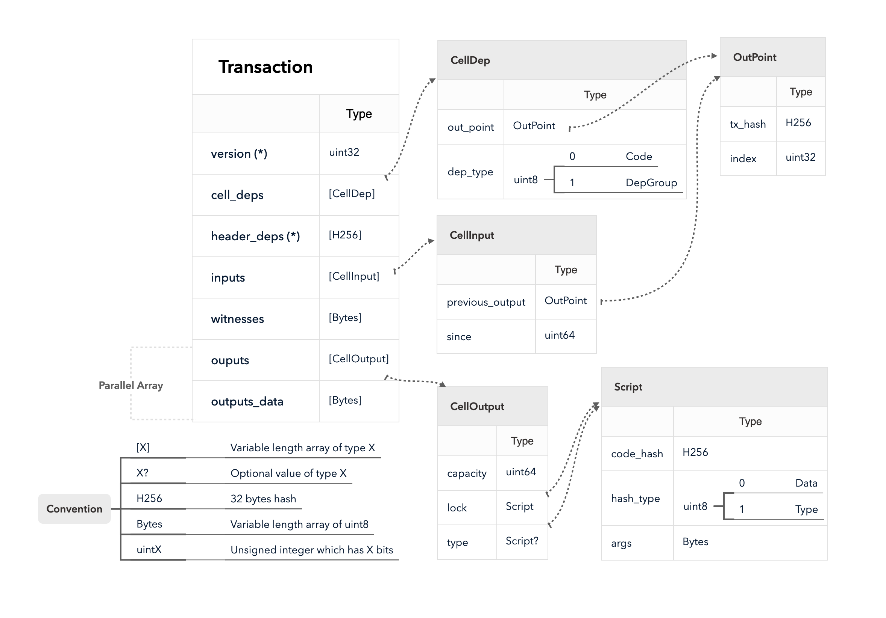

上图是关于转账结构的概览。有别与逐字逐句地解释各个名词，我将会介绍 CKB 转账能够提供的各种特殊结构，以及这些名词在其中的具体意思。


## Part I：核心特点

### 价值存储

CKB 采用 UTXO 模型。一笔交易会销毁一部分在之前转账中创建的输出（作为输入），然后创建出一些新的输出。我们在 CKB 中将交易输出称之为 Cell。因此 Cell 和交易输出是可替换的。

下图显示了在此层中会出现的专有名词。


此交易销毁了输入 `inputs` 中的 cells，同时在输出 `outputs` 中创建了新的 Cells。

CKB 主链将交易打包成块。我们可以在区块中利用编号是从零（也就是创世区块）开始递增的非负整数，作为区块编号来链接区块链上的区块。在区块中的交易也是按照顺序排列的。我们会说一个有较小的区块编号的区块是较早的区块，一个交易如果在一个较早的区块上，或者它在这个区块的位置在其他交易之前，那么它也是较早的交易。下图中，区块 i 是比区块 i+1 早产生的，然后交易发生的顺序为：tx1，tx2，tx3。


在所有先前的交易中，一个可用（Live）的 Cell 会以输出而非输入的形式出现。而一个被销毁（Dead）的 Cell，则代表它是以输入的形式，在先前的某笔交易中被使用过。一笔交易只能使用可用（Live）的 Cell 作为输入。

我们可以通过除了 `witnesses` 之外的所有交易字段，计算得到交易哈希。关于如何计算交易哈希，可以参阅附录。

交易哈希是独一无二的。既然 Cell 总是被交易创建出来，而每一个新的 Cell 在交易输出的数组中都有自己的位置，所以我们可以通过交易哈希以及输出索引去引用一个 Cell。`OutPoint` 结构是一种引用类型。交易在输入时会使用 `OutPoint` 来引用先前被创建的 cells，而非将它们嵌入交易。


Cell 将 CKB 代币存储在字段 `capacity` 中。一币交易不能够凭空铸造 capacity（也就是 CKB 代币），所以交易必需符合以下的规则：

```
总和 (输入中每个的 cell 的容量) ≥ 总和 (输出中每个 cell 的容量)

输入中所有 Cell 容量的总和要大于等于输出中所有 Cell 容量的总和。
```

矿工可以收取这两者之间的价差做为手续费。

```
交易手续费 = 总和 (输入中每个的 cell 的容量) - 总和 (输出中每个 cell 的容量)
```

如果你熟悉比特币，那么就会发现在（CKB在）价值存储层是和比特币类似的，但是比特币缺乏锁脚本来保护交易输出的所有权。CKB 正好有这个特征，但是在我们探索这个话题之前，让我们先来谈谈 Cell 数据和代码定位吧，这是所有 CKB 脚本特征的依据。


### Cell 数据

除了作为存储价值的 token，CKB Cell 还可以储存任意数据。

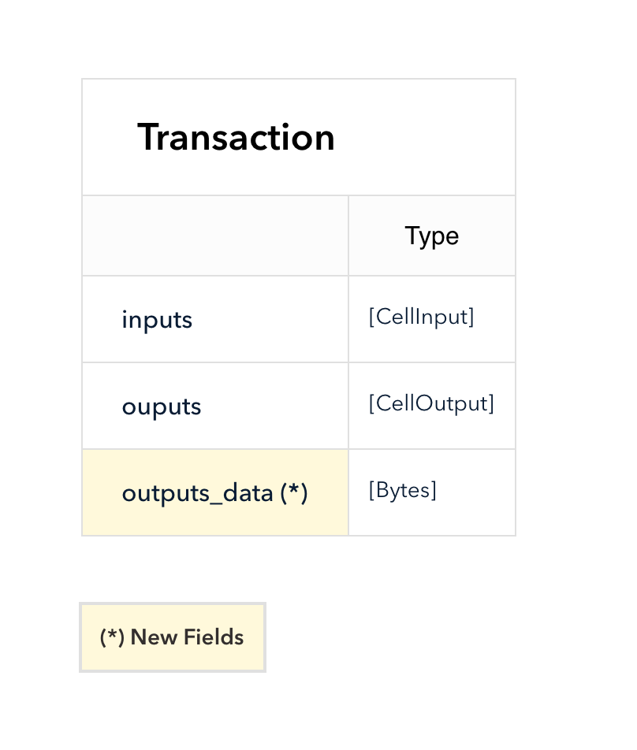

字段 `outputs_data` 是输出的并行数组。在 `outputs` 中第 i 个 Cell 的数据对应的是 `outputs_data` 中的第 i 项。


Cell 中的 `capacity` 不只代表 token 的数额，也代表能够存储数据的容量。这也是为什么把它叫做（capacity 容量）的原因，因为它也代表了 Cell 的存储容量。

Capacity 不仅能用于存储数据，它需要涵盖 cell 中的所有字段，包括 `data`，`lock`，`type`，以及 `capacity` 本身。

计算占用容量的规范请参考：https://github.com/nervosnetwork/ckb/wiki/Occupied-Capacity

交易一定会创建一个占用容量小于（输入）Cell 容量的输出 Cell。

```
占用的（cell）≤ cell 的容量
```

### 代码定位

Cell 中有两个字段的类型是 `Script`。CKB VM 会运行所有输入 cells 中的 `lock` 脚本，还会运行所有输入和输出 cells 中的 `type` 脚本。

我们需要区分了代码和脚本这两种术语：

* 脚本具有脚本结构
* 代码是指 RISC-V （可运行的）二进制文件
* 一个代码 Cell 是其数据为代码的 Cell

脚本并没有直接包含代码。看下面的脚本结构。现在我们先忽略哈希类型的 `Type` 以及 `args` 字段。

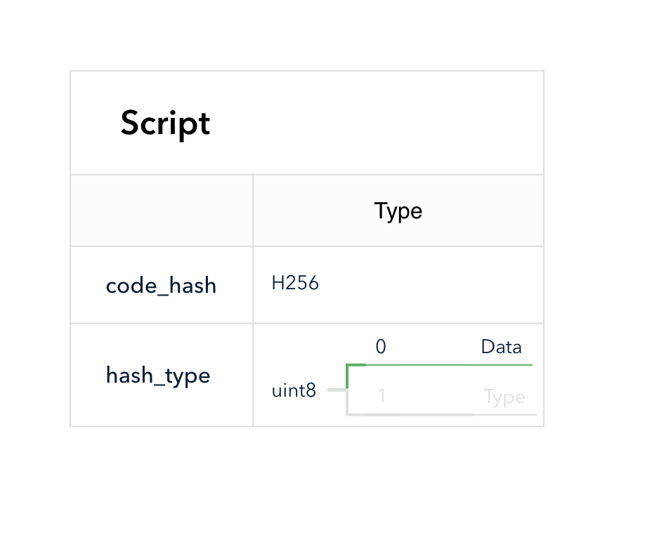

当 CKB-VM 需要运行一个脚本时，它必须要先找到它的代码。字段 `code_hash` 和 `hash_type` 就是用来定位代码的。

在 CKB 中，脚本代码会被编译成 RISC-V 二进制文件。这个二进制文件是以数据的形式存储在 Cell 中的。当 `hash_type` 是数据时，脚本会被定位在一个数据哈希和脚本的 `code_hash` 相同的 Cell 中。Cell 的数据哈希，正如其名，是从 Cell 的数据中算出来的（详见附录 A）。在交易中，查找的范围是有限制的，脚本只能从 `cell_deps` 中找到一个匹配的 Cell。


下图将解释 CKB 如何找到对应的脚本代码。

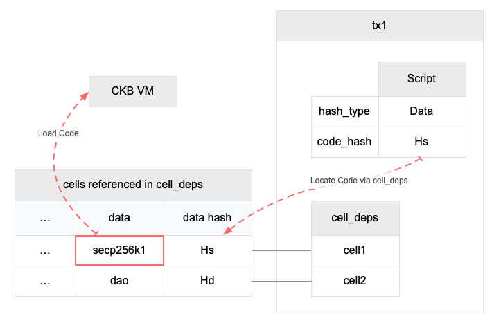

如果你想使用 CKB 中的脚本，那么应该遵循代码定位的规则：

* 把你的代码编译成 RISC-V 二进制文件。你可以在建构系统 cells 代码的[仓库](https://github.com/nervosnetwork/ckb-system-scripts)中找到一些案例。
* 通过一笔交易，创建一个将二进制文件作为数据的 cell，并将交易发到链上。
* 建构一个脚本结构，其中 `hash_type` 是 “Data”，`code_hash` 是创建的二进制文件的哈希。
* 使用这个脚本作为 Cell 的类型脚本或锁脚本。
* 如果脚本需要在交易中运行，需要在 `cell_deps` 中包含代码 Cell 的 `out_point`。

在 `cell_deps` 的 cells 必须是可用的（Live 的），就像是 `inputs` 一样。但别于 `inputs`，一个只在 `cell_deps` 中被使用的 cell 不会被认为是（已经被）销毁（Dead）了。

以下两个章节，我们将讨论如何在交易中使用脚本去锁定 cells，以及如何在 cells 上创建合约。

### 锁脚本

每个 cell 都有一个锁脚本。当 cell 作为输入在一笔交易中被使用时，锁脚本必须执行。而当脚本只出现在输出中时，则不需要在 cell_deps 中显示相应的代码。一笔交易只有在所有输入的锁脚本都正常（执行并）退出的情况下才有效。因为输入的脚本需要运行，所有它可以作为锁来决定谁可以解开并销毁这个 cell，同时决定谁可以花费存储在这个 cell 中的 capacity（也就是 CKB 代币）。

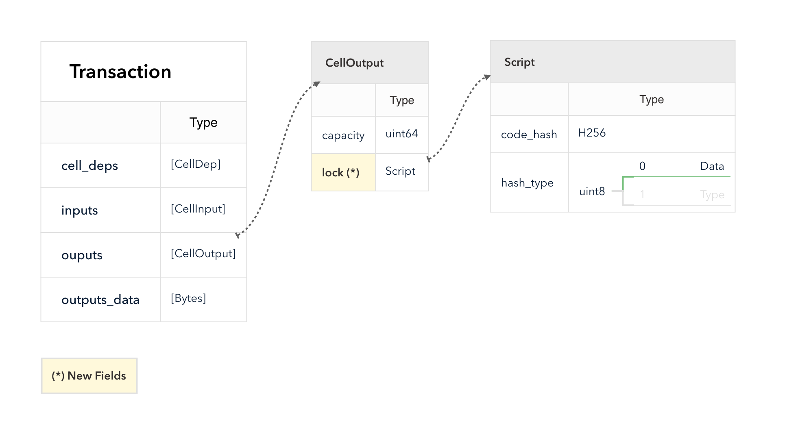

以下是一个总是可以正常（执行并）退出的锁脚本的代码范例。如果使用这段代码作为锁脚本，那么任何人都可以销毁这个 cell。

```
int main(int argc, char *argv[]) {
    return 0;
}
```

最主流的锁定数字资产的方式是采用非对称加密的方式进行数字签名。

这个签名算法有两个要求：

* Cell 必须要包含公钥的信息，所以只有真正的私钥才可以进行有效的签名；
* 交易必须包含签名，而且通常把整个交易作为消息去进行签名。

在 CKB 中，公钥指纹可以存储在脚本结构的 `args` 字段中，同时签名可以存储在交易的 `witnesses` 字段中。我使用「可以」是因为这只是一个推荐的方式，并被用在（系统）默认的 [secp256k1 锁脚本](https://github.com/nervosnetwork/ckb-system-scripts/blob/master/c/secp256k1_blake160_sighash_all.c)中。脚本代码可以读取交易的任何一部分，所以锁脚本可以选择不同的协定，例如，可以将公钥信息存储在 cell 数据中。当然，如果所有的锁脚本都遵循推荐的协定，它可以简化创建交易的程序，比如钱包。

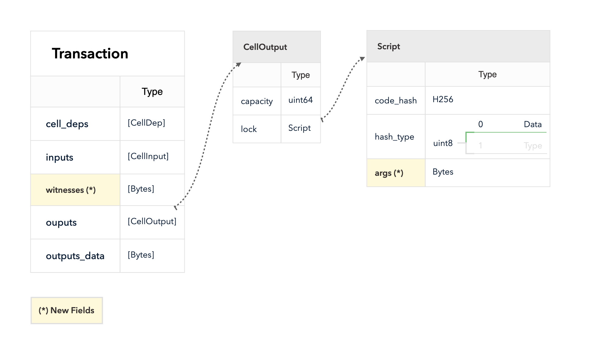

让我们看一下脚本代码是如何被定位和载入的，以及代码如何访问输入、脚本参数（script args）和 witnesses。

首先，请注意 CKB 并不会逐个运行所有输入的锁脚本。首先它会根据锁脚本将输入进行分组，相同的脚本只会运行一次。CKB 运行一个脚本会分成三个步骤：脚本分组（script grouping），代码定位（code locating）以及运行（running）。


上图展示了前两个步骤：

1. 首先，CKB 会通过锁脚本对所有输入进行分组。在交易示例中，有两种不同的锁脚本在输入中被使用。虽然它们都定位到相同的代码，但它们有不同的 args。让我们来看一下 g1。这里有两个索引为 0 和 2 的输入。脚本和输入索引会在步骤三后被使用。
2. 然后 CKB 会从 cell deps 中查找代码。通过数据哈希 `Hs` 解析到对应的 cell，并把该 cell 的数据作为代码。

目前 CKB 可以载入脚本代码的二进制文件并通过 entry 函数开始运行代码。脚本可以通过 syscall 的 `ckb_load_script` 进行自读取。

```
ckb_load_script(addr, len, offset)
```

许多 CKB 的 syscalls 都被设计为从交易中读取数据。这些 syscalls 有一个指明哪里可以读取数据的参数。比如，载入第一个 witness：

```
ckb_load_witness(addr, len, offset, 0, CKB_SOURCE_INPUT);
```

前三个参数表明已读取的数据需要存储在哪里，以及需要读取多少 bytes。在接下来的章节中，我们先忽略它们。

第五个参数是数据源。`CKB_SOURCE_INPUT` 代表从交易输入中读取，第四个参数 `0` 则是输入数组的索引。`CKB_SOURCE_INPUT` 也可以用于读取 `witnesses`。

这里不会有像 `CKB_SOURCE_WITNESS` 一样的数据源，因为 witnesses 是 inputs 的并行数组。通过索引他们会呈现一对一的关系。

记住当我们通过锁脚本将输入进行分组时，我们已经保存了输入的索引。这个信息用于为分组创建虚拟的 witness 和输入数组。这段代码可以通过一个特殊的数据源 `CKB_SOURCE_GROUP_INPUT`，利用虚拟数组中的索引去读取输入或 witness。读取 witness 时，通过 `CKB_SOURCE_GROUP_INPUT` 只读取拥有相同位置并具有特定输入的 witness。

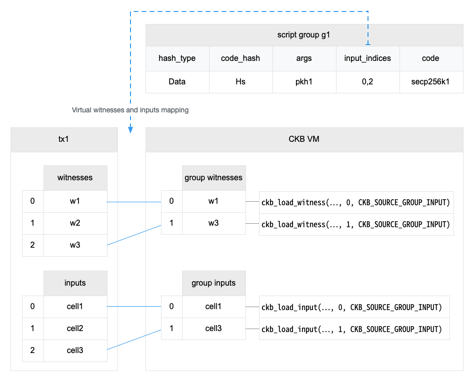

所有读取与输入数据相关的 syscalls，都可以使用 `CKB_SOURCE_GROUP_INPUT` 以及虚拟输入数组中的索引，比如 `ckb_load_cell_*` 的 syscalls 系列。


### 类型脚本

类型脚本类似于锁脚本，但有两点不同:

* 类型脚本是可选的。
* 在任一交易中，输入和输出中的类型脚本，CKB 都必须运行。

虽然我们可以在 CKB 中只使用一种类型的脚本，但是我们不会想要在一个单一的脚本中混淆（脚本）不同的职责。

锁脚本作为输入时才会被执行，因此它的首要职责是保护 cells。只有拥有者可以以输入的形式使用 cell，并花费存在其中的（CKB）代币。

类型脚本是用来在 cells 上创建合约的。当你收到一个具有特殊 type 的 cell 时，你可以确定这个 cell 已经在特定的代码中通过了验证。同时在这个 cell 被销毁时，这段代码也会被执行。类型脚本的典型用例就是用户自定义 token。因为类型脚本必需在输出中运行，所以 token 的发行必须被授权。

在输入中运行类型脚本对合约至关重要，举个例子，有一个允许用户抵押一定数量的 CKB 来租一份线下资产的合约。如果不在输入中运行这个类型脚本，用户只需销毁这个 cells 并将这部分 capacity 转移到一个没有类型脚本的新的 cell 中，就可以在不经过授权的情况下从合约中取回 CKB 代币。

运行类型脚本的步骤和锁脚本也很相似。除了：

1. 没有类型脚本的 cells 会被忽略
2. 脚本群组同时包含输入与输出


像 `CKB_SOURCE_GROUP_INPUT`，有一个特殊的数据来源 `CKB_SOURCE_GROUP_OUTPUT` 可以将索引用于脚本数组的虚拟输出数组。


### Part I 交易结构概述

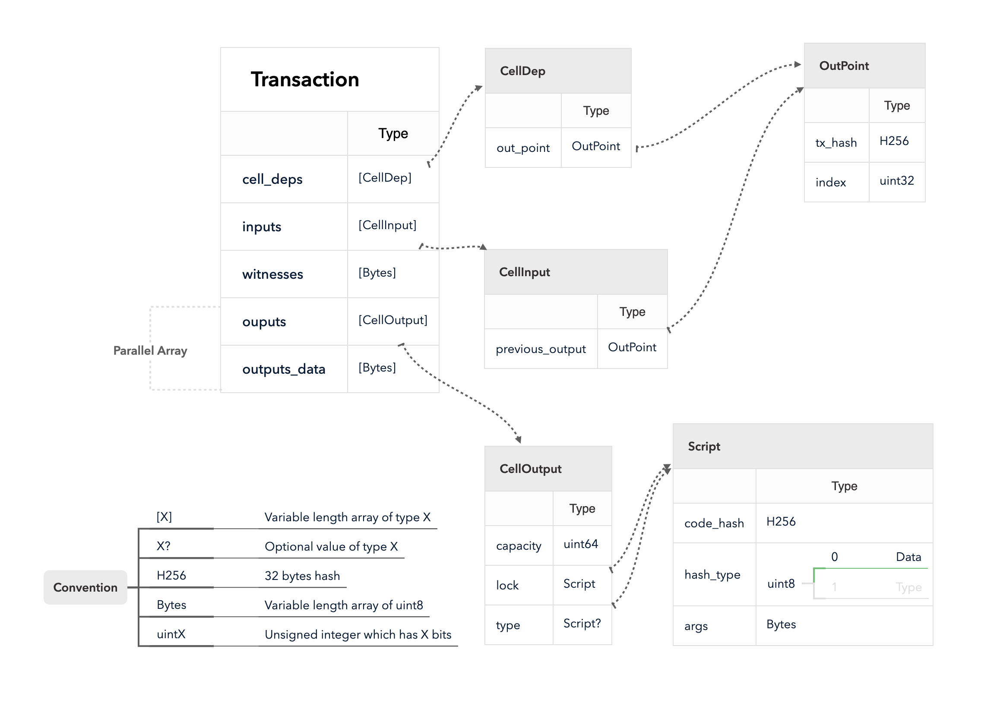


## Part II：扩展

在第一部分，我介绍了交易提供的核心特征。在第二部分，我将介绍一些 CKB 不需要它们也能正常运行的扩展套件的特征，当然这些套件可以使得 cell 模型变的更好。

下图是在本部分中出现的新字段的总览（标注为黄色底）。


### DepGroup

DepGroup 是一个包含了很多 cells 成员的 cell。当一个 DepGroup 的 cell 在 `cell_deps` 中被使用时，它和将把（DepGroup 内所有的 cells 成员）添加到 cell_deps 中是一样的。

DepGroup 在 cell 数据中存储了一个 `OutPoint` 的序列化列表。每一个 `OutPoint` 都指向 DepGroup 中的一个成员。

`CellDep` 结构中有个叫 `dep_type` 的字段，可以用于区分直接提供代码的普通 cells，还在 `cell_deps` 中通过扩展其成员的 DepGroup。


DepGroup 会在定位和运行节点之前被扩展，只有被扩展的 `cell_deps` 才是可见的。


在 v0.19.0 版中，锁定脚本 secp256k1 被分成 code cell 和 data cell。code cell 通过 cell_deps 载入 data cell。所以如果一个交易要解锁一个被 secp256k1 锁定的 Cell，那么他一定要在 `cell_deps` 加上两个 Cell。在 DepGroup 中，交易就只需要 DepGroup 即可。

我们分离 secp256k1 cell 有两个原因。

* code cell 很小，这让我们可以在区块大小限制很低的时候就更新它。
* data cell 可以被共享。例如，我们已经安装了另一个使用 ripemd160 的锁定脚本来验证公钥的哈希值。这个脚本就重用了 data cell。


### 可升级脚本

在第一部分的锁定脚本中，我描述了一个脚本如何通过 Cell 的数据哈希来定位它的代码。一旦一个 Cell 被创建，那么相关联的脚本代码就不会被改变，因为要找到一个有相同的哈希的另一段代码是不可能的。

脚本有另一个 `hash_type` 的选项，Type。

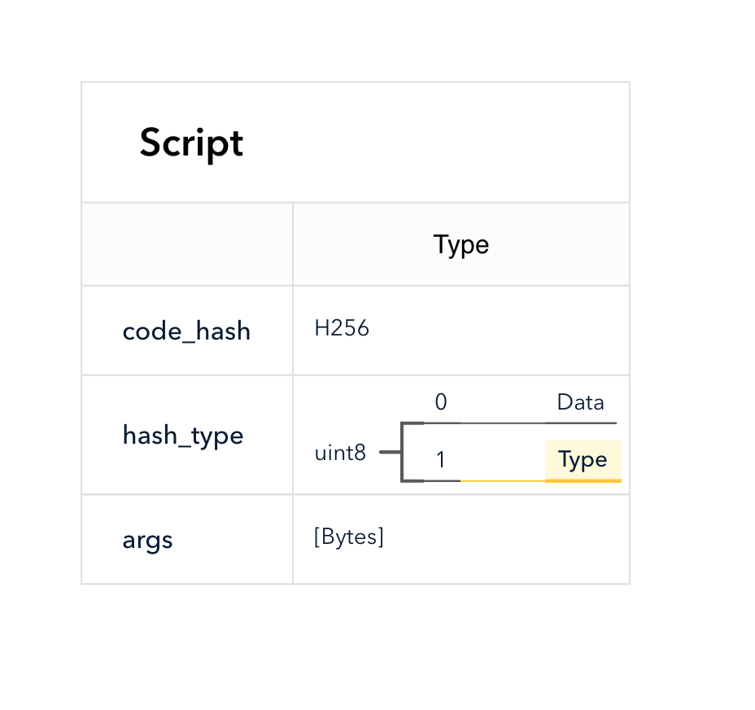

当脚本使用了 `hash_type` 的 Type，它会匹配相等于 `code_hash` 的类型脚本哈希的 Cell。类型脚本的哈希是从 Cell 的 type 字段中计算出来的（详见附录 A）。

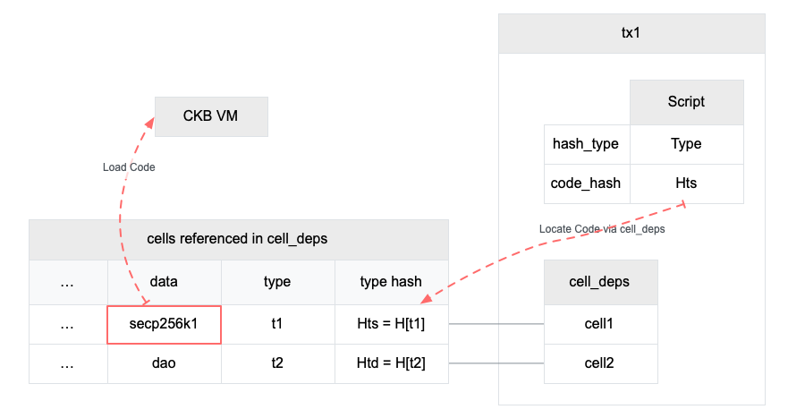

现在，如果 Cell 用一个通过类型脚本哈希来定位代码的脚本，并通过创建一个具有相同类型脚本的新 Cell，那么我们就可以升级代码了。新的 Cell 已经有更新的脚本，在 `dep_cells` 中增加了新 Cell 的交易将会使用这个新的版本。

然而，这只解决了一个问题。如果一个作恶者创建一个拥有同种类型脚本的 Cell，但使用伪造的代码作为数据，那么这还是不安全的。作恶者可以通过使用假的 Cell 作为 dep 来绕开脚本验证。下一章将描述解决第二个问题的脚本。

因为被类型脚本哈希引用的代码是可以被改变的，所以你必须信任脚本作者使用的这种类型脚本。虽然使用哪个版本取决于哪一个 Cell 在 `dep_cells` 的交易中被添加。用户总是可以在签署交易之前检查代码。但是，如果脚本用于解锁 Cell，那么签名检查甚至是可以被略过的。


### Type ID

我们选择 Cell 类型脚本哈希的理由是用来支持可更新的脚本。如果作恶者想要创建具有特化的形态脚本的 Cell，那么交易必须被类型脚本的代码验证。

Type ID 就是这种类型的类型脚本。如其名所示，他确保了类型脚本的独特性。

这个特征包括了多种类型脚本，所以我会用不同专有名词去区分他们：

* Type ID 的代码 Cell 是一个存储代码来验证 Type ID 是否是独一无二的 Cell。
* Type ID 的代码一样有类型脚本。我们现在不会在意实际的内容，让我们假设类型脚本的哈希是 T1
* Type ID 是一个 `hash_type` 是 Type，且 `code_hash` 是 T1 的类型脚本。

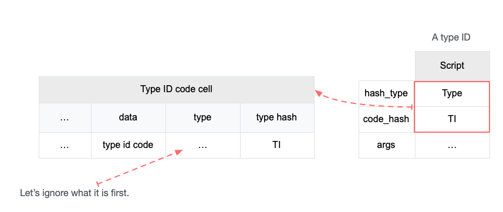

从 Part 1 的类型脚本中我们知道，类型脚本会先将输入与输出聚集。换句话说，如果一个类型脚本是 Type ID，那么在同个群组的输入与输出都有同样的 Type ID。

Type ID 的代码在验证的就是在任何代码中，至少都会有一组输出和一组输入。根据输入与输出的数量，一个交易允许有多种 Type ID 群组，Type ID 群组被分成以下三种不同的类型：

* Type ID Creation Group 只有一个输出
* Type ID Deletion Group 只有一个输入
* Type ID Transfer Group 有一个输入和一个输出

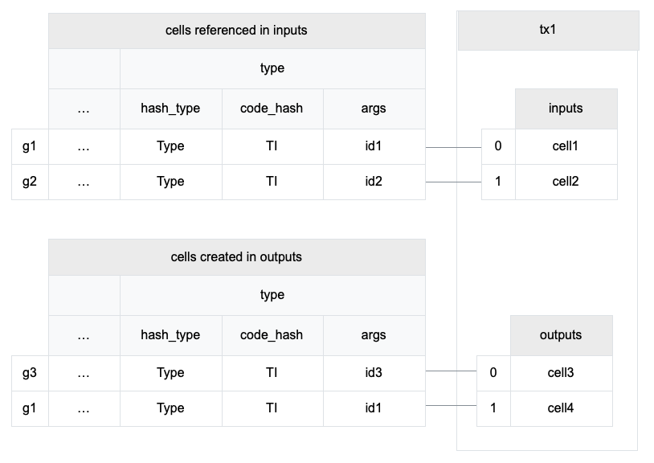

上图的交易中有三种交易 ID 群组

* g1 是将 Type ID 从 cell1 转移到 cell4 的 Type ID Transfer Group
* g2 是为 cell2 删除 Type ID 的 Type ID Deletion Group
* g3 是为 cell3 创建新 Type ID 的 Type ID Creation Group

在 Type ID Creation Group 中，在 `args` 中的唯一参数，是在群组中这个交易的第一个 `CellInput` 结构的哈希，还有 Cell 的输出索引。例如，在群组 g3 中，id3 是一个在 `tx.inputs[0]` 和 0（cell3 在 `tx.outputs` 的索引）上的哈希。

这里只有两种可以通过特定的 Type ID 来创建新 Cell 的方法：

1. 在 `tx.inputs[0]` 的哈希上创建一个交易以及任意等于特定值的索引。因为一个 Cell 只能被以输出的形式在链上被使用一次，所以 `tx.inputs[0]` 在每个交易中必须是不同的。这个问题和找到一个哈希碰撞的值是一样的，可能性几乎可以忽略不计。
2. 在同一个交易中破坏旧的 Cell

我们假设方法 2 是唯一一个创建相等于既有 Type ID 的新 Cell 的方法。这个方法需要原有的所有者的授权。


Type ID 的代码只能通过 CKB-VM 的代码实行，但我们会选择在 CKB 的节点上以一个特殊的系统脚本来实行它，因为如果我们以后想升级 Type ID 的代码，就必须要通过一个递归依赖的类型脚本代码，来将自己作为类型脚本。


TI 是一个包含 T1 本身内容的哈希

Type ID 的代码 Cell 使用了一个特殊的类型脚本哈希，也就是十六进制 ascii 码。

```
0x00000000000000000000000000000000000000000000000000545950455f4944
```


### Header Deps

Header Deps 可以让脚本来读取区块头。这个功能有一定的限制以确保交易被确定。

我们只会在所有交易中的脚本已经有确定的结果时，才会说一笔交易已经确定了。

Header Deps 允许脚本去读取其哈希已经列在 `header_deps` 中的区块头。还有另一个先决条件，是交易只能在所有列在 `header_deps` 的区块都已经在链上时（叔块除外），才可以被添加到链上。

有两种方式可以利用 `ckb_load_header` 系统调用来载入脚本中的区块头

* 通过 header deps 的索引
* 通过输入或一个 cell dep。如果区块有被列在 `header_deps` 的话，系统调用会返回 Cell 被创建出的那个区块。


第二种载入区块头的方法有另一个好处是，脚本会知道 Cell 位于被载入的区块中。DAO 取出交易借此来获取存储容量的区块号。

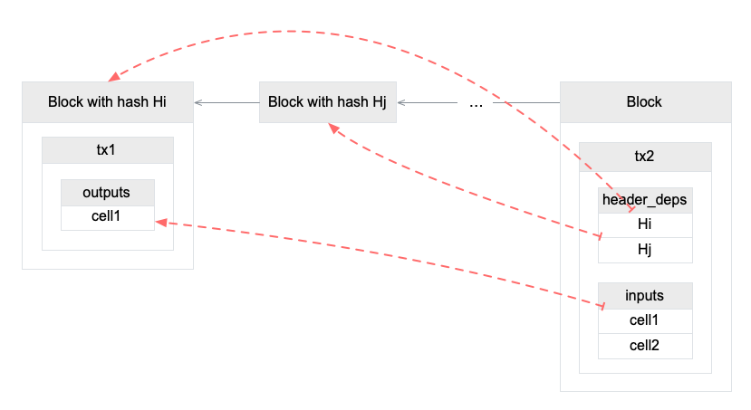

loading header 的示例

```c
// Load the first block in header_deps, the block Hi
load_header(..., 0, CKB_SOURCE_HEADER_DEP);

// Load the second block in header_deps, the block Hj
load_header(..., 1, CKB_SOURCE_HEADER_DEP);

// Load the block in which the first input is created, the block Hi
load_header(..., 0, CKB_SOURCE_INPUT);

// Load the block in which the second input is created.
// Since the block creating cell2 is not in header_deps, this call loads nothing.
load_header(..., 1, CKB_SOURCE_INPUT);
```


### 其他字段

字段 since 可以避免交易在特定时间前被挖出。详见 [since RFC](https://github.com/nervosnetwork/rfcs/blob/master/rfcs/0017-tx-valid-since/0017-tx-valid-since.md)。

字段 version 是预留在未来使用的。在当前版本中，它必须等于0。


### 特例

在此系统中有两个特殊的交易。

第一个是 cellbase，这是每个区块中的第一个交易。cellbase 中只有一个仿真的输入。在这个仿真的交易中， `previous_outpoint` 不会关联人其他的 Cell，而是会设置一个特殊值。since 必须设置为区块编号。

Cellbase 的输出是链上给旧区块的奖励和交易费。

Cellbase 是特殊的，因为他的输出容量并不来自于输出。

另一个特殊的交易是 DAO 的取款交易。它也有部分的输出容量并非来自于输入。这部分是在 DAO 中锁定 Cell 所获得的收益。CKB 会通过检查是否有使用 DAO 作为类型脚本的输入来识别 DAO 的取款交易。


### 附录A：计算多种哈希

加密原语 — blake256

CKB 使用 blake2b 作为默认的哈希演算法。我们用 blake256 来表示一个函数，用个人的「ckb-default-hash」来获取 blake2b 哈希的前 256 位。


### 交易哈希

交易哈希是 blake256(tx_hash_digest(tx))，其中 `tx_hash_digest` 是将交易中的所有字段（不包括 witnesses）序列化为二进制的方法。序列化规范还没有进行最终的确定，现在，您可以通过 RPC ` _compute_transaction_hash` 获取交易哈希。


### Cell 数据哈希

cell 的数据哈希只是 blake256(data).


### 脚本哈希

脚本哈希是 blake256(serialize(script))，serialize 将脚本结构转换成二进制块。序列化规范还没有进行最终的确定，现在你可以通过 RPC ` _compute_script_hash` 来获取脚本哈希。